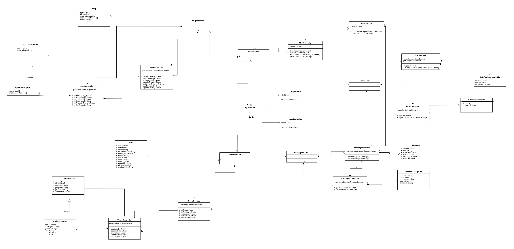

## Chatter App Project Overview

Chatter is a real-time messaging app that allows users to communicate with each other in groups.
The app is built using a variety of modern web development technologies, including:

- React
- NestJs
- PostgreSQL
- Nodejs
- Tailwind.css
- Typescript
- Socket.io
- Vite

## Project Features

Some of the main features of Chatter include:

- Real-Time Actions: The app offers real-time messaging features such as join group, send messages, create groups, and new group members.

- Create Groups: Users can create groups and add members to them.

- Markdown Formatting: Users can send messages in markdown format, which allows them to format their text in a variety of ways.

- Authentication: Each user has their own session authentication for one day.

- Mobile-Friendly Design: The app is designed to be mobile-friendly, with a responsive design that works well on a variety of devices.

- Profile Management: Users can change their name, profile picture, phone, and password.

## Screenshots

Here are a few screenshots of the Chatter app:

## Diagrams

